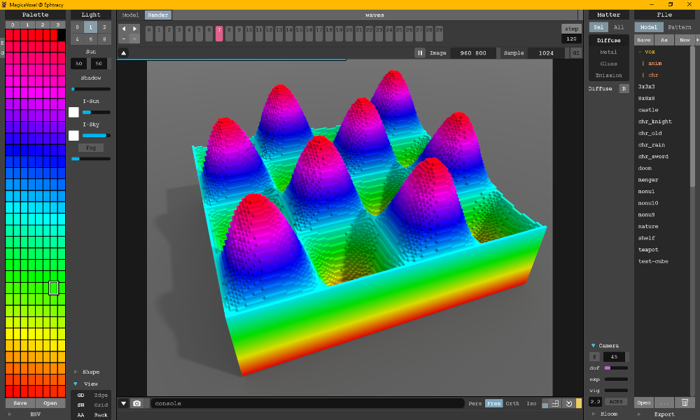

# VoxBox
The Voxel Toolbox (a.k.a 'VoxBox') is a Python package for working with voxel data, primarily for making voxel art and video games.

## Features
* Export NumPy array as [MagicaVoxel](https://ephtracy.github.io/) file.

## Installation
Download the code update your $PYTHONPATH environment variable to ensure your Python interpreter can find it. I have no current plans to make this into a proper package with PIP installer, etc.

## Example
The following snippet shows how to export a NumPy array as a MagicaVoxel file. See [waves.py](examples/waves/waves.py) for the complete code

```python
# Define the size of the volume
row_count = 126
col_count = 126
plane_count = 64
frame_count = 30

palette = generate_rainbow_colourmap()

# Create a NumPy array
voxels = np.zeros((frame_count, plane_count, col_count, row_count), dtype=np.uint8)

# Later we will choose a material based on the height (plane) of the voxel
palette_offset_per_plane = (len(palette) - 1.0) / plane_count

# For each voxel in the volume
for frame in range(0, frame_count):
    
    print("Generating frame {} of {}...".format(frame + 1, frame_count))
    
    # Create a simple heightmap (could also load something from disk)
    time_step = frame / frame_count
    heightmap = generate_waves_heightmap(row_count, col_count, time_step)

    for plane in range(0, plane_count):
        for col in range(0, col_count):
            for row in range(0, row_count):
                
                # Get the height from the heightmap, and
                # scale to the height of the volume
                height = heightmap[col, row]
                height *= plane_count
                
                # If the current voxel is below the
                # heightmap then set it to be solid.
                if plane <= height:
                    voxels[frame][plane][col][row] = palette_offset_per_plane * plane
    

# Save the volume to disk as a MagicaVoxel file.
print("Saving results...")
filename = "waves.vox"
voxbox.magicavoxel.write(voxels, filename, palette)
print("Done.")
```
    
# Result
The above code generats the following image:

